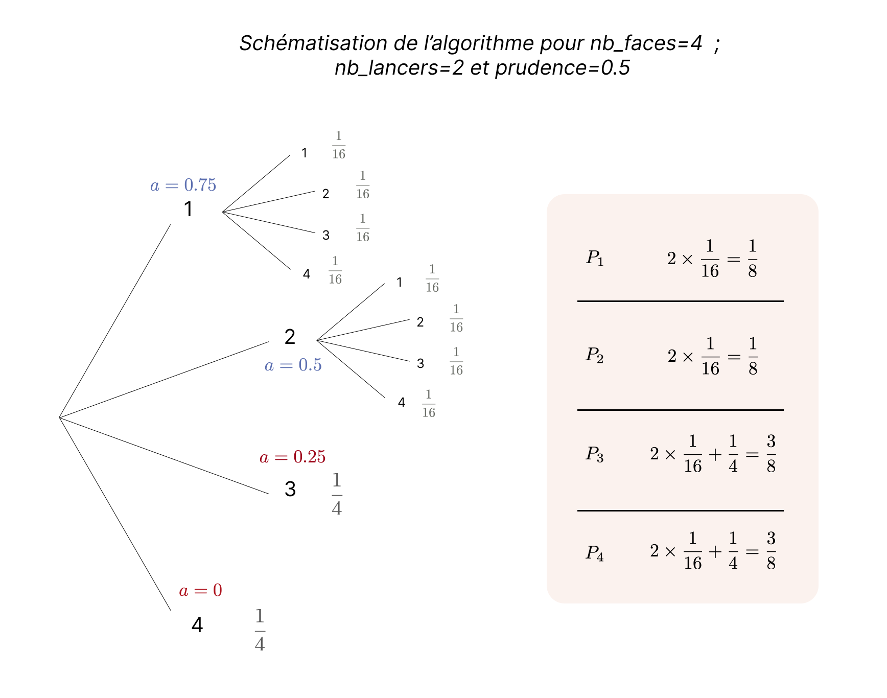

# Simple Dice Game Strategy
## <u>Règles du jeu</u>
Il s’agit d’un jeu de dé à un seul joueur. On fixe un nombre de lancers maximum.
A chaque coup, le joueur lance un dé et décide si :
<ul>
    <li>il empoche le montant indiqué par le dé</li>
    <li>il relance le dé (pour espérer gagner plus)</li>
</ul>

Si le nombre de lancers atteint 0, alors le joueur empoche le montant indiqué par le dé.

## <u>Première approche, formule trouvée</u> 
Premièrement nous avons cherché quelle était la probabilité lorsqu'on a un certain nombre sur le dé, d’obtenir un nombre 
inférieur ou égal au prochain lancer. Nous avons trouvé : 

<p align="center">
    
    
</p>

<em>avec d : nombre indiqué par le dé
et f : nombre de faces du dé</em>

---

Cette formule ne marche que pour le prochain lancer. Si on a un nombre n de lancers restants, du fait que les événements soient tous indépendants les uns des autres, la probabilité 
d’obtenir un nombre inférieur ou égal au nombre actuel sur tous les prochains lancers :


<p align="center">
    
    
</p>

---

Donc la probabilité qu’au moins un futur lancer sur les n prochains lancers soit supérieur au lancer actuel est l’événement contraire. Cela correspond à la probabilité 
d’augmenter les gains en continuant:

<p align="center">
    
    
</p>

## <u>Stratégie</u> 
La stratégie que nous proposons est donc de regarder cette probabilité et de relancer le dé tant qu’elle est supérieure à un certain nombre. Ce nombre est appelé Prudence.


## <u>Simulation</u> 
Afin de simuler un grand nombre de parties et estimer une moyenne des gains si l’on applique notre stratégie, nous avons créé un programme python. Détaillons notre fonction 
jeu() chargée de simuler une partie et retourner le gain obtenu :

```python
from random import randint


def jeu(nb_faces:int, nb_lancers:int, prudence:float)->int:
    """
    On prend en argument la prudence, le nb de lancers et le nb de faces.
    La prudence doit être comprise entre 0 et 1
    """
    
    i = 1
    
    while i >= prudence and nb_lancers > 0: # On continue le jeu tant qu’il reste au moins un lancer et que i est supérieur ou égal à la prudence
        d = randint(1, nb_faces) # On “lance” le dé
        nb_lancers = nb_lancers - 1 # On enlève un au nombre de lancers
        i = 1-(d/nb_faces)**nb_lancers # On met à jour i
        
    return d # On renvoie le gain obtenu lors de la partie simulée
```


Nous pouvons donc maintenant simuler un grand nombre de lancers et calculer la moyenne des gains pour différentes prudences puis tracer un graphique :

<p align="center">
    
    
</p>

## <u>Calcul</u>
La simulation nous donne déjà un bon aperçu, mais nous avons essayé de calculer la moyenne des gains.
Le problème que nous rencontrons est que nous relançons le dé seulement si le nombre a est supérieur ou égal à la 
prudence. Nous avons donc décidé de créer un algorithme construisant l'arbre. L'arbre à donc une particularité qui est
qu'une nouvelle branche est créée seulement si a est supérieur ou égal à la prudence. En additionnant les issues 
on a le pourcentage de chance _P_ pour chaque entier de 1 à n (n étant le nombre de faces du dé).
<p align="center">
    
</p>

Par la suite on peut calculer une moyenne pondérée de cette manière : 
<p align="center">
    
</p>